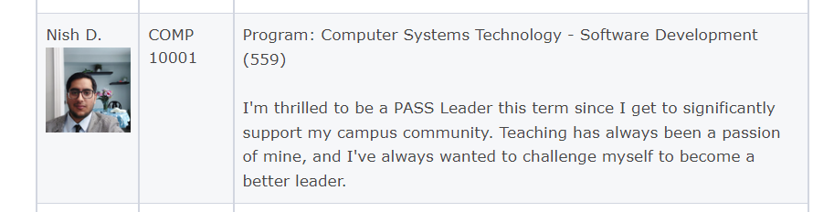

# PASS COMP10001-Winter2023
Every Saturday there is a PASS session organized by me for COMP 10001 students with the focus on helping them understand the basics of python programming language. Throughout the winter2023 semester during these sessions, we will put our knowledge to test by developing some projects; projects that will also help students build their portfolio.

# Zoom Link to join the session:
Link-> [Nish's Saturday Zoom Session](https://mohawkcollege.zoom.us/j/95227377950?pwd=K29zTUFXNEZHSVVJS0QweE1LVWF2Zz09)  
  

# To know more about PASS
To learn more about PASS please visit Mohawk College's Official Website [Peer Assisted Study Sessions (PASS)](https://www.mohawkcollege.ca/learning-support-centre/peer-assisted-study-sessions-pass)

## Developed Using 💻
+ [Python3](https://docs.python.org/)

## Installation or Getting Started
Run the following command in the terminal:

	git clone https://github.com/Nishkarsh01/pass-comp10001-winter2023.git
or download the zip file from github.
    

## Usage
After extracting the files,

    cd pass-comp10001-winter2023/
    .py files for a particular date can be accessed by changing directory to the directory of that specific date

## Collaborate
To collaborate, reach us on [nishkarsh.dubb@mohawkcollege.ca]()

## Further help/Reference
+ [Python Documentation](https://docs.python.org/)
+ [w3schools.com](https://www.w3schools.com/)
+ [udemy-JosePortilla-CompletePythonBootcamp](https://www.udemy.com/course/complete-python-bootcamp/learn/lecture/9388520?start=0#overview)
